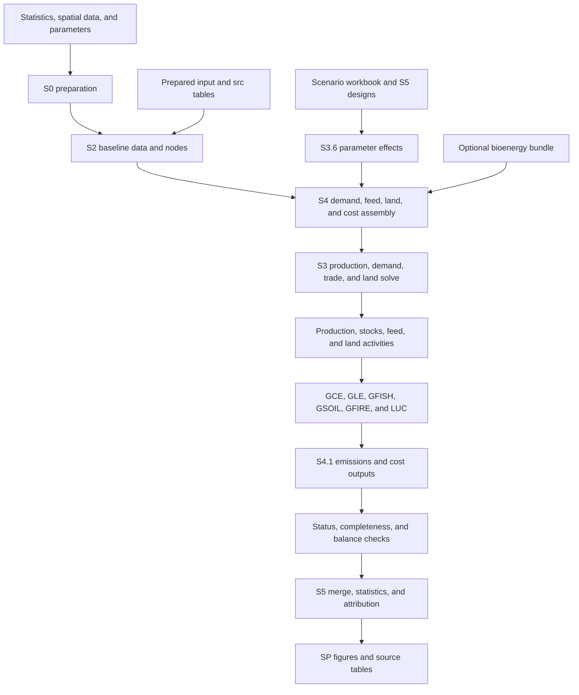
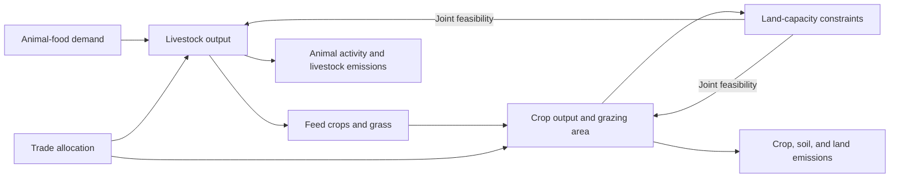

# Net-zero food: model and code guide

**Documented source:** `Code/bin/new_clear` · **Snapshot date:** 22 September 2026

This guide explains how the food-system model converts baseline data and scenario assumptions into production, demand, trade, feed use, land use, greenhouse-gas emissions, and mitigation costs. It describes the current implementation, its main equations and feedbacks, the experiment workflows, and how to interpret and reproduce outputs.

The companion [code catalog](CODE_CATALOG_en.md) explains all **192 active source files: 179 Python scripts, 10 Shell scripts, 2 SQL files, and 1 notebook**. It separately inventories **18 currently present historical audit/reproduction Python sources**. The [source inventory](source_inventory.json) records interfaces, direct imports, file-reference clues, configurations, and SHA-256 hashes. The [validation record](validation.json) reports documentation coverage, source preservation, and link checks.

The documentation was prepared through static source inspection. It does not report a new model run or new numerical results. This tree includes bioenergy but does **not** contain the `STS_*` livestock thermal-stress extension in `new_TS_clear`; ordinary exogenous temperature drivers are a separate mechanism.

## Contents

1. [Purpose and interpretation](#purpose)
2. [Code organization and execution flow](#architecture)
3. [Data objects, inputs, and units](#data)
4. [Optimization model](#optimization)
5. [Demand, nutrition, and trade](#demand)
6. [Livestock, feed, and land feedback](#feed)
7. [Land-use change and carbon bookkeeping](#land)
8. [Physical emissions accounting](#emissions)
9. [Scenario definitions and parameter propagation](#scenarios)
10. [Mitigation costs and attribution](#costs)
11. [Bioenergy integration](#bioenergy)
12. [The complete S4 pipeline](#pipeline)
13. [Sensitivity, Monte Carlo, and strategy experiments](#experiments)
14. [From simulations to figures](#figures)
15. [Outputs, diagnostics, and resume](#outputs)
16. [Configuration and running the model](#running)
17. [Dependencies and implementation boundaries](#boundaries)
18. [Maintenance and glossary](#maintenance)

<a id="purpose"></a>
## 1. Purpose and interpretation

The model links food consumption and other commodity uses to national production, international trade, livestock feeding, land requirements, and process-level emissions. Scenarios change diets, waste, yields, feed efficiency, agricultural emission factors, forest objectives, land-carbon incentives, and optionally bioenergy demand. Repeated runs quantify sensitivities, uncertainty, intervention potentials, and strategy interactions.

The principal spatial unit is a country identified by an M49 code. Commodity and process sets come from the dictionary, rather than a single hard-coded global list. Regional price/market relationships can operate while production remains represented by country. A separate aggregation option can aggregate production nodes.

Four distinctions are essential when reading results:

- **Net zero is a research objective, not an automatic constraint.** A normal run does not necessarily impose global emissions equal to zero. Target-oriented land-carbon-price searches belong to a specific S5.7 workflow.
- **The default is nutrition-driven allocation.** In exact `nutrition` mode, future production is chosen through demand balance, resources, trade restrictions, and the objective. The conventional future price-elastic supply equation is skipped. Prices and production therefore should not all be interpreted as standard competitive-market forecasts.
- **Physical emissions, priced abatement, statistical importance, and attributed reduction are different measures.** Each has its own baseline, scope, and denominator.
- **Climate assumptions are exogenous.** This code does not feed its computed emissions into a climate model and then re-solve using an updated climate trajectory.

For a first reading, follow Sections 2, 4, and 12. For a particular scientific mechanism, read Sections 5-11. For execution, read Sections 15-17 and locate the entry point in the catalog.

<a id="architecture"></a>
## 2. Code organization and execution flow

```text
Code/
  input/                   Statistical, spatial, and prepared runtime inputs
  src/                     Dictionaries, scenario workbooks, parameter tables
  output/                  Scenario runs, experiments, summaries, figures
  bin/new_clear/
    S0_*                   Data preparation, calibration, historical summaries
    S1_0_schema.py         Shared data structures
    S2_0_load_data.py      Input loading, mapping, and baseline construction
    S3_*                   Optimization and physical/scenario coupling
    S4_*                   Complete runs and result aggregation
    S5_*                   Experiments, batching, merging, and attribution
    g*/luc*/lme*           Physical emissions and legacy process modules
    SP_*/SA*/SC*           Figures, analysis, and diagnostics
    submit_sbatch_*        Slurm submission wrappers
    biomass_data_templates/ Example input structures
    _codex_*/              Historical audits and task records
    docs/model_guide/      This guide and the code catalog
```



This is a conceptual dependency diagram. S0 numbers do not specify a universal execution sequence: some utilities prepare independent datasets, others summarize existing results, and some write derived workbooks. Existing prepared inputs usually remove the need to rerun those utilities.

The main coordinator is [S4_0_main.py](../../S4_0_main.py). [S3_1_emissions_orchestrator_fao.py](../../S3_1_emissions_orchestrator_fao.py) retains a historical interface and placeholders; it is not the complete physical emissions pipeline.

[config_paths.py](../../config_paths.py) discovers the enclosing `Code` directory and provides `NZF_CODE_ROOT`, `NZF_INPUT_DIR`, `NZF_SRC_DIR`, `NZF_OUTPUT_DIR`, and `NZF_LUH2_DIR` overrides. Some older utilities still use fixed or working-directory-relative paths. The project is shared through OneDrive, so operating systems need their own valid local paths, not separate code-sync copies.

<a id="data"></a>
## 3. Data objects, inputs, and units

### 3.1 Shared objects and keys

[S1_0_schema.py](../../S1_0_schema.py) defines the basic state:

| Object | Contents and role |
|---|---|
| `Node` | Country, commodity, year, baseline supply `Q0`, baseline demand `D0`, reference price `P0`, elasticities, temperature/yield multipliers, process intensities `e0_by_proc`, and metadata |
| `Universe` | Active countries, commodities, years, processes, and mappings for country codes, market/scenario regions, and commodity groups |
| `ScenarioConfig` | Historical period and future years; defaults are 2010-2020 and `[2080]`, plus selected baseline parameters |
| `ScenarioData` | Nodes, universe, and configuration passed to model-building and scenario routines |
| `DataPaths` | Runtime input/configuration paths, defined in S2 |
| `FeedDemandOutputs` | Feed totals and species/commodity detail from S3.2 |
| `BioenergyBundle` | Reconciled historical uses, future feedstock demand, resource/land interfaces, and diagnostic tables |

M49 identifiers are normally three-digit strings prefixed by an apostrophe, such as `'156`. ISO3 and names support mapping and display. Preserve this normalization through merges. The dictionary's production, emission, and nutrition item mappings are different classification layers; identical-looking text does not establish a valid mapping between them.

### 3.2 Main input families

The authoritative path definitions are in [DataPaths](../../S2_0_load_data.py#L68).

| Family | Representative inputs | Model use |
|---|---|---|
| Dictionary and scenarios | `dict_v3.xlsx`, `Scenario_config_new.xlsx` | Valid sets, item/process mappings, scenario selectors, MC bounds |
| Production and demand | Completed FAOSTAT production/yield CSV; completed Food Balance Sheets workbook | Baseline output, yields, domestic demand, food/feed/residual uses |
| Population and income | WPP population; SSP GDP change workbook | Nutrition totals and demand drivers |
| Prices and trade | World unit values, price wedges, crop/livestock trade, forestry trade, Armington elasticities | Reference prices, baseline net trade, trade capacities and responses |
| Nutrition | Food-only historical nutrition profile, intake constraints, nutrient conversion factors | Per-capita diets, physical food demand, minimum intake |
| Livestock and feed | Animal stocks, producing-head ratios, feed per head, grass shares, pasture dry-matter yields | Output-to-animal conversion, feed crops, grazing land |
| Land | `Land_cover_base_refill.xlsx`, LUH2 states/transitions/mask, `LUCE_parameter.xlsx` | Land capacities, transitions, forest and carbon-pool parameters |
| Emissions | Crop/livestock/soil parameters, historical inventories, fisheries panels, fire references | Historical anchors and future activity-based process calculations |
| Costs | `food_mitigation_cost_database_v2.0.json`; legacy MACC/XLSX inputs | Country-strategy unit costs or segmented MACC functions |
| Bioenergy | Historical feedstock, scenario targets, conversion parameters, resource constraints | Optional physical feedstock, energy, and land accounting |

This table documents interfaces; input availability and scientific provenance must be established for the intended run. Template rows specify data structure and are not evidence that a parameter has been calibrated.

### 3.3 Unit conventions

| Quantity | Common unit | Conversion or interpretation |
|---|---|---|
| Commodity output/demand | t | Forestry may require m3-to-mass handling; preserve the commodity-specific basis |
| Animal activity | head; producing/slaughtered head as applicable | Stock and annual producing heads are not interchangeable |
| Feed | kg DM/head, t DM, or physical commodity t | Convert dry matter to commodity mass using the relevant factor |
| Land | ha | Solver scaling such as `land_scale` does not change reported physical units |
| Energy | TJ; GJ/tDM; scenario inputs may use EJ | 1 TJ = 1,000 GJ; distinguish primary from final energy |
| Gas emissions | kg or kt of CO2, CH4, or N2O | Identify mass units before applying GWP |
| Summary emissions | Usually kt CO2e; figures often Gt CO2e | kt to Gt: multiply by 10^-6 |
| Priced abatement | t CO2e | Distinct from kt CO2e solver/output intensities |
| Unit mitigation cost | USD/tCO2e | Not USD/t of commodity |
| Nutrition | kcal/person/day, g/person/day, kcal/t | Annual totals require population, 365 days, and consistent mass conversion |

The unified [S4.1 GWP constants](../../S4_1_results.py#L34) are CO2 = 1, CH4 = 27.2, and N2O = 273. Legacy or already aggregated tables may use a different convention. Inspect source/gas/unit fields before combining them, and do not apply GWP a second time to CO2e.

<a id="optimization"></a>
## 4. Optimization model

### 4.1 Decisions and constraints

The default backend is [S3_0_ds_linear_regional.py](../../S3_0_ds_linear_regional.py), implemented with Gurobi. Depending on the active configuration, decisions include commodity production `Qs`, demand `Qd`, prices, net imports, land states and conversions, abatement quantities, and slack variables.

The model links these decisions through historical anchors, future demand rules, market clearing, trade caps, crop/grassland requirements, forest and restoration restrictions, production-growth bounds, and optional mitigation-cost/bioenergy interfaces. In nutrition mode, food demand is determined from profiles and drivers, while feed can remain endogenous to livestock production.

The following equations summarize the main relationships for country c, commodity j, and year t. They suppress scaling, branch-specific exceptions, and some slack terms; they are explanatory equations rather than a replacement for the implemented constraint system.

```text
Qd[c,j,t] = Food[c,j,t] + Feed[c,j,t] + Residual[c,j,t]
            - CoproductFeedCredit[c,j,t]

Qs[c,j,t] + NetImports[c,j,t]
    = Qd[c,j,t] + ExplicitBioenergyCropUse[c,j,t]

CropArea[c,t] ~ sum_j(Qs[c,j,t] / Yield[c,j,t])
GrassArea[c,t] ~ GrassDryMatter[c,t] / PastureDryMatterYield[c,t]
```

Actual crop/grass coefficients also incorporate baseline reconciliation and mapping. Local quantities may balance through trade, while aggregate market constraints account for permitted shortage/excess. See [market_balance_diagnostics.py](../../market_balance_diagnostics.py) for the output-side balance convention.

### 4.2 Nutrition-driven versus elasticity-driven supply

The solver sets `nutrition_supply_driven = (method == 'nutrition')`. For future nodes in that branch it [skips the usual price-elastic supply equation](../../S3_0_ds_linear_regional.py#L7126). Production is selected by the remaining constraints and objective.

Outside that branch, the linear supply relationship has the approximate form:

```text
Qs = Q0 * [1 + eta_y * (Ymult - 1) + eta_T * (Tmult - 1)]
     + Q0 * eps_s * (P - P0) / P0
     + sum_k Q0 * eps_cross[k] * (P[k] - P0[k]) / P0[k]
```

The implementation additionally filters cross terms, handles missing/zero reference prices, imposes price bounds, applies quantity scaling, and can rewrite zero-price shutdown behavior. Historical nodes use anchored quantities. A configuration label such as `hard_equation` does not override the exact-nutrition branch.

### 4.3 Objective and slack

The objective combines enabled terms for market imbalance, trade adjustments, land/forest slack, land conversions, abatement costs, land-carbon incentives, optional production-value costs, and small solution-selection penalties. Their weights and physical units differ.

In the current S4 configuration, production-cost terms are disabled, BASE mitigation-cost optimization is off, ordinary scenario cost mode is `unit_cost`, and the land-carbon price is zero. A large penalty enforces a modeling preference or discourages violations; it should not automatically be interpreted as an observed economic resource cost. The solver objective is therefore not a direct estimate of total social cost.

With `objective_strategy='auto'`, [objective selection](../../S3_0_ds_linear_regional.py#L11022) uses a single-stage objective for one future year and a lexicographic slack-then-cost approach for multiple future years. In the latter, the model first minimizes feasibility slack and then minimizes costs while preserving the best slack level within its tolerance.

An available solution can still contain permitted shortage, surplus, or land-cap exceedance. Examine the diagnostics alongside solver status.

### 4.4 Alternative PWL formulation

[S3_0_ds_emis_mc_full.py](../../S3_0_ds_emis_mc_full.py) provides a logarithmic/piecewise-linear formulation and cached-MC interfaces. It explicitly rejects `unit_cost`. Its capabilities and nonlinear approximations differ from the default linear path, so switching `use_linear_model` alone does not preserve all experiment semantics.

<a id="demand"></a>
## 5. Demand, nutrition, and trade

### 5.1 Food and non-food uses

Nutrition profiles specify food intake, not total domestic supply. S2 separates food-balance uses so that food, feed, seed, losses, processing, and other residual uses can be handled consistently. In annual energy terms:

```text
RequiredFoodEnergy[c,t] = Intake_kcal_per_person_day[c,t]
                          * Population[c,t] * 365
```

Commodity allocation uses the profile and commodity nutrient factors. Minimum intake constraints supplement this structure; a country-level minimum and a commodity diet profile are not the same restriction.

The default future residual mode is `base`, with `residual_base_ratio=0.8`. Loss-related scenario changes operate on the relevant residual component while seed handling remains separate. The alternatives include population scaling and switching residual uses off. An enabled bioenergy bridge first removes historical crop feedstock already present in residual use and subsequently introduces explicit future bioenergy demand.

### 5.2 Demand modes

| Mode | Main interpretation |
|---|---|
| `nutrition` | Profile-based food demand plus feed and residual uses; future supply uses demand/resource allocation |
| `nutrition_band` | Allows a band around nutrition demand; the current S4 epsilon is 0.05 |
| `nutrition_anchor` | Anchors demand to nutrition and adds price responses; population already included in the anchor must not be applied twice |
| `elasticity` | Uses own/cross-price responses and population/income drivers under the selected equation rules |

Ruminant-reduction scenarios act through diet/profile and substitution rules. `ruminate_supplement` controls whether replacement maintains the historical total, meets minimum intake, uses fish, or omits supplementation. This mechanism is more specific than multiplying all livestock production by a common factor.

### 5.3 Market geography and trade

The current S4 setting is `market_clearing_mode='regional_armington'` with `use_regional_aggregation=False`. Thus regional prices/trade relationships coexist with country-level production nodes. Aggregating production into regions is a separate choice.

Positive net imports mean imports exceed exports. A country with demand greater than domestic production can be feasible through trade. Trade limits can depend on baseline volumes, country/commodity size, self-sufficiency, import dependence, and the selected cap scale. Nutrition-profile demand nodes may be added for commodities absent from domestic production.

Both country-level balance and aggregate market clearing matter. A global total alone can hide a severe local shortage, an import-cap conflict, or an offsetting surplus elsewhere.

<a id="feed"></a>
## 6. Livestock, feed, and land feedback

[S3_2_feed_demand.py](../../S3_2_feed_demand.py) translates livestock activity into dry-matter requirements and allocates these between crop feed and grass. The calculation can be summarized as:

```text
AnimalActivity ~ LivestockOutput / OutputPerAnimal
DryMatterNeed = AnimalActivity * DryMatterIntakePerAnimal
CropFeed[j] = DryMatterNeed * CropFeedShare * CommodityAllocation[j]
              / DryMatterFraction[j]
GrassArea = GrassDryMatterNeed / PastureDryMatterYield
```

Producing-head ratios, slaughter/turnover conventions, animal category, and dairy/non-dairy distinctions modify the first relationship. The result tables include crop-feed demand, grass requirements, species dry-matter detail, and crop feed by species.

The default `feed_crop_link_mode='dynamic_constraints'` inserts livestock-output-to-feed coefficients into the optimization model. More livestock output therefore increases feed-crop demand inside the same solve; the extra crop land and grazing pressure can constrain livestock production in return.



This feedback is a simultaneous constraint relationship, not necessarily a repeated Python loop. The alternative `iterative` mode updates feed requirements and re-solves up to iteration/convergence limits. `off` removes that dynamic link. Grassland has a separate `dynamic` versus `static` switch; static grassland uses an outer iteration and should not be confused with the feed-link setting.

Feed efficiency and animal productivity can both alter feed per tonne of product, through different physical terms. Changes should be traced through per-head intake, producing activity, crop-feed demand, and grazing demand to avoid counting the same improvement twice.

<a id="land"></a>
## 7. Land-use change and carbon bookkeeping

### 7.1 Land states and calibration

Crop area is related to output divided by yield; grazing area is related to grass dry matter divided by pasture productivity. `land_demand_calibration_mode='base_stock_capacity'` reconciles activity-derived requirements with observed base land capacity. This reduces the risk that inconsistent baseline statistics appear as new future land conversion.

The current `new_clear` baseline land source is **FAO**, selected from the simplified land-cover workbook. LUH2 remains available for alternative baseline/spatial processing. The solver can represent crop, pasture, forest, and other available land, subject to conservation, conversion, restoration, and optional forest-target restrictions.

### 7.2 Coupling modes

| `luc_coupling_mode` | Land accounting input | Optimization relationship |
|---|---|---|
| `Qs_demand` | Changes inferred from solved production/demand | Primarily a post-solve land-demand path |
| `solver_luc` | Actual solver land states and conversion flows | Land constraints already affect production |
| `optimize_luc` | Solver land states/flows plus a linearized carbon interface | Enabled land-carbon/objective coefficients can affect land choice |

The default is `optimize_luc`. Although CFG contains `luc_opt_mode='none'`, [S4 promotes it to `explicit`](../../S4_0_main.py#L14759) in this high-level mode. The default land-carbon price is zero, so the mode name alone does not establish a nonzero carbon incentive.

Default pasture-to-cropland selection uses `per_ha_cost`. Artificial source-priority weights are only active in the corresponding priority-ranking mode. A stored priority list therefore does not by itself prove that every run converts nonforest land, then pasture, then forest in that order.

### 7.3 Endpoint land versus annual carbon flows

The solver commonly represents only the future endpoint, 2080. Land-carbon accounting can still reconstruct an internal annual transition path from 2020 to that endpoint. The default is `linear_to_target`; alternatives include endpoint, front-loaded, back-loaded, and smoothstep paths.

[luc_emission_module.py](../../luc_emission_module.py) then follows biomass, soil, and wood-product carbon pools and legacy responses. Changing the timing of conversion can change endpoint-year emissions even if final land areas match.

Keep these quantities separate: final land stock, annual gross conversion, accumulated conversion, carbon-pool legacy effects, annual emissions, and cumulative emissions. A 2080 emissions value is not automatically the sum of 2020-2080 emissions.

### 7.4 Background flows and forest recovery

Default background deforestation uses recent historical reference years and an exponential decay with a 30-year half-life and a 0.25 lower share. Its `accounting_only` terminal-state mode and `annual_projection` carbon mode keep that background distinct from endogenous terminal land pressure.

Restoration is tied to released agricultural land, bounded physically, and protected against land-conversion cycles. The configured proxy forest-increase cap is 50% of baseline forest area. Existing-forest sinks and uptake on newly restored land are accounted for separately to avoid assigning the same sink twice.

[S3_5_land_use_change.py](../../S3_5_land_use_change.py) also exposes a price-linked intensification proxy whose default coefficient is zero. Raising a land-carbon price should not be described as automatically increasing agronomic yields.

<a id="emissions"></a>
## 8. Physical emissions accounting

The optimizer uses emission intensities and linear approximations where needed for its objective and cost constraints. Formal post-solve accounting reconstructs physical activity and calculates the appropriate processes in dedicated modules.

| Module | Main activity basis and processes |
|---|---|
| [GCE](../../gce_emissions_complete.py) | Crop production/harvest area, residue nitrogen and dry matter, residue burning, rice, and synthetic fertilizer |
| [GLE](../../gle_emissions_complete.py) | Livestock stocks/producing activity, enteric fermentation, manure management, application, and pasture deposition |
| [GFISH](../../gfish_emission_module_complete.py) | Capture/aquaculture composition, aquaculture production/area, and CH4/N2O factors |
| [GSOIL](../../gsoil_emission_complete.py) | Drained organic soils associated with cropland/pasture and CO2/N2O parameters |
| [GFIRE](../../gfire_emission_fixed_module.py) | Fixed historical-reference fire emissions |
| [LUC](../../luc_emission_module.py) | Land transitions, harvest, shifting cultivation, and dynamic carbon pools |
| [Historical LUC](../../luc_historical_module.py) | Standardized observed historical land emissions and sinks |

Historical observations often anchor past years; future years use scenario activity and parameters. The exact historical/future split is module-specific.

[S4_1_results.py](../../S4_1_results.py) normalizes mappings, gases, units, and summary dimensions. S4 and the reporting layer reconcile overlapping model and physical-module sources. Adding all solver emissions to all physical-module totals would double count overlapping processes.

The required-module manifest covers GFIRE, LUC, GSOIL, GLE, GFISH, and GCE. Module completion is an explicit part of run validity; a solved food-allocation model with a failed emissions module is not a complete formal emissions result.

Legacy `*_fao_legacy.py` and manure modules remain available for historical/reference paths. Their presence does not mean they are summed into every current run. Likewise, negative forest/restoration emissions, positive process reductions, bioenergy substitution credits, and priced abatement require separate interpretation.

<a id="scenarios"></a>
## 9. Scenario definitions and parameter propagation

[S3_6_scenarios.py](../../S3_6_scenarios.py) loads workbook rows as `ScenarioEffect` objects. Selectors identify countries/regions, commodities/categories, processes, gases, and years. `apply_scenario_to_data()` translates these effects into parameters consumed by S4 and the physical modules.

| Input expression | Meaning |
|---|---|
| `rate` | Relative change; a conventional rate of -0.2 becomes a factor of 0.8, subject to the variable's own semantics |
| `multiplier` | Direct factor; 0.8 is already 0.8 and must not receive an additional +1 |
| `amount` / `absolute` | A physical quantity, threshold, or monetary amount as defined by the variable |
| `Y2020_*` | A baseline-referenced bound/expression; requires the relevant parser and historical reference |

The distinction matters especially in MC. [mc_bound_utils.py](../../mc_bound_utils.py) handles legacy bounds, while the full effect sampler handles richer variable-specific cases. The cached logarithmic path rejects nonpositive multiplicative factors; the linear path can preserve valid explicit zero factors. Missing values should not silently become valid zero costs or zero activity.

| Intervention | First affected component | Main downstream consequences |
|---|---|---|
| Diet / ruminant share | Nutrition profile and replacement food | Animal production, feed crops, grazing, trade, land, emissions |
| Food loss and waste | Applicable loss/residual demand | Total production requirements and land |
| Yield/productivity | Crop yield or relevant animal productivity | Area per tonne, animal activity, resource feasibility; supply response depends on mode |
| Feed efficiency | Feed requirement per activity/product | Crop-feed and grazing demand, indirect emissions |
| Process EF | Selected process/gas factor | Physical process emissions and eligible process-cost scope |
| Fertilizer/manure/residue management | Input efficiency or material/treatment allocation | Activity and emission pathways together |
| Forest target / land-carbon price | Land restrictions or objective | Land allocation, production feasibility, carbon-pool trajectory |
| Bioenergy | Feedstock and energy demand | Commodity uses, land, coproducts, resource feasibility, separate energy credits |

Combining interventions changes the system jointly. Independent reductions need not add to the full-package reduction because production, feed, land, and trade respond together. Coalition reruns in S5.7 estimate those interactions rather than assuming additivity.

<a id="costs"></a>
## 10. Mitigation costs and attribution

### 10.1 Runtime cost contract

The canonical runtime source is `input/Price_Cost/Cost/food_mitigation_cost_database_v2.0.json`. [cost_database_v2.py](../../cost_database_v2.py) validates its `metadata` and `solver_export` structure, version/schema, target year, units, country coverage, unique country-strategy keys, and final-cost rules. The reader returns `MitigationCostDatabase`, including unit costs keyed by normalized M49 and model strategy key.

S4 [loads the validated database](../../S4_0_main.py#L13906), combines it with dictionary process mappings and a matched BASE emission ledger, and supplies the solver parameters. S2 retains a legacy XLSX cost loader for explicit compatibility paths. The cost-comparison notebook, Python analysis, report builder, and SQL queries are separate analytical tools; they do not replace the runtime loader.

| Cost layer | Database strategy | Model key |
|---|---|---|
| System | `ruminant_reduction` | `RuminantReduction` |
| System | `losses_ratio` | `LossWaste` |
| System | `yield_rate` | `YieldRate` |
| System | `feed_intensity` | `FeedEfficiency` |
| Process | `enteric_fermentation_management` | `EntericF` |
| Process | `manure_management` | `Manure` |
| Process | `crop_residue_soil_management` | `Residue` |
| Process | `rice_management` | `Rice` |
| Process | `fertilizer_efficiency` | `Fertilizer` |

Scenario registries may use aliases such as `rice_cultivation`; keep scenario identifiers, physical processes, and cost keys distinct. A cost metadata interval does not imply automatic interval sampling. The configured final unit-cost field is the actual runtime quantity.

### 10.2 Physical and priced reduction

For a measure with a defined reference and emission scope:

```text
A = eligible positive abatement within the pricing scope, in tCO2e
u = unit cost, in USD/tCO2e
C = u * A
AggregatedUnitCost = sum(C) / sum(A), when sum(A) > 0
```

The reporting logic distinguishes physical reduction, priced reduction, and unpriced or unavailable components. Land sinks or global net reductions may lie outside a particular process-cost scope. Valid zero-cost records remain valid; missing cost coverage is a different condition. The database final-cost rule clips negative preferred costs to zero, which differs from retaining a negative-cost MACC.

BASE must match the scenario's configuration and physical emission scope. A production-only reference is insufficient for the strict process-cost accounting path. [S4.1 cost summaries](../../S4_1_results.py#L2860) and [S5_cost_summary_outputs.py](../../S5_cost_summary_outputs.py) preserve country/measure and experiment-level results.

Explicit strategy ownership prevents multiple overlapping owners from charging the same abatement. An explicit empty owner list disables that ownership mode; `None` retains the compatibility/detection behavior. S5 coalition attribution is subsequently responsible for distributing interacting system reductions.

Input-side regional cost aggregation is another distinct operation: when regional production aggregation is enabled, S4 can use simple means of country unit costs. Output-side aggregate unit costs use abatement weighting. Those operations should not be treated as equivalent.

### 10.3 Alternative cost and attribution concepts

- `unit_cost` uses fixed country-strategy unit costs.
- `MACC` uses segmented marginal abatement cost curves.
- `off` disables the corresponding mitigation-cost optimization path.
- A land-carbon price is a separate incentive and is explored explicitly in S5.7.3.
- Shapley attribution distributes a package's reduction across interacting strategies; it is not a substitute for the cost ledger.

Some cost concepts can represent policy price signals rather than direct resource expenditure. Preserve their metadata when interpreting cross-measure cost comparisons. S5.9 also checks database provenance/version/hash; reusing a filename with different content does not preserve the same experiment.

<a id="bioenergy"></a>
## 11. Bioenergy integration

Bioenergy is disabled by default and activated through `bioenergy_enabled`. It adds physical feedstock and energy accounting to the food/land system, rather than a complete independent energy-system optimizer.

### 11.1 Preparation chain

```text
Historical energy statistics -> S0.50 -> country/carrier history and shares
History + carrier/feedstock bridge -> S0.51 -> historical physical feedstock
Eligible-land maps -> S0.54 --+
Non-crop resources -> S0.55 --+-> S0.52 -> resource, yield, and land limits
Scenario energy paths + country shares + limits -> S0.53 -> scenario targets
```

The source-defined low/medium/high scenarios in S0.53 use AR6 C1-C2 P10/P50/P90 biomass-energy trajectories. This describes the preparation code's selection rule; the documentation does not independently reanalyze the external scenario database.

### 11.2 Physical interfaces

[S3_3_bioenergy.py](../../S3_3_bioenergy.py) builds the runtime bundle. Where the specified energy basis and conversion efficiency require it, the basic conversion is:

```text
Feedstock_tDM = Energy_TJ * 1000 / (LHV_GJ_per_tDM * ConversionEfficiency)
Feedstock_t = Feedstock_tDM / DryMatterFraction
```

Primary/final energy and carrier/feedstock distinctions determine the applicable conversion. The bundle also reconciles historical FBS demand so crop feedstock is not counted both as residual use and explicit bioenergy use.

| Interface | Treatment |
|---|---|
| Market-linked crop feedstocks | Enter commodity balance as a separate use |
| Dedicated energy crops | Consume eligible land/resource capacity through dedicated interfaces |
| Non-crop resources | Use availability/feasibility tables; not every resource becomes a joint solver decision |
| Feed coproducts | Credit mapped feed commodities, with a baseline-feed cap |
| Residue removal | Passes into relevant crop-residue management/emission interfaces |
| Residue-feed competition | Default solver mode is `diagnostic_only`, not a universal hard constraint |
| Energy and resource shortfalls | Assessed before and after solving |
| Fossil substitution and BECCS | Reported through dedicated accounting outputs; inclusion in a selected net-emission total must be traced explicitly |

Current coproduct handling uses `tdm_as_t_equivalent`, treating dry-matter tonnes as mapped commodity-tonne equivalents until a fuller feed-value conversion is available. That approximation is recorded rather than interpreted as exact nutritional equivalence.

Bioenergy may increase land pressure while supplying coproduct or energy benefits. Its net effect depends on feedstock composition, trade, resource limits, and land-carbon accounting. A successful food-system optimization does not alone prove that the energy target has been met.

S5.9 evaluates strategy MACCs under low/medium/high bioenergy cases. Its `preflight` mode performs interface checks and can rebuild derived inputs/write outputs; it is not a purely read-only operation and does not prove global feasibility.

<a id="pipeline"></a>
## 12. The complete S4 pipeline

The principal call chain is `main()` -> [run_one_pipeline()](../../S4_0_main.py#L22136) -> [_run_one_pipeline_impl()](../../S4_0_main.py#L10148). The public wrapper catches failures so the run reaches a terminal structured status.

| Stage | Work and main result |
|---|---|
| Run selection | Resolve BASE, selected workbook scenarios, a scenario list, or the separate MC mode |
| Run initialization | Select output directory, create run identity/status, and apply directory-cleanup rules |
| Baseline loading | Construct dictionary mappings, production/demand nodes, nutrition, prices/trade, feed, land, and baseline emissions |
| Scenario application | Resolve selectors, bounds, years, physical effects, and cost ownership |
| Coupling assembly | Construct food/residual demand, dynamic feed, grassland, land conversions, and optional bioenergy interfaces |
| Cost/reference loading | Validate the cost database and matched baseline information required by the selected method |
| Solve | Build and solve the linear or PWL model; use configured outer iterations or objective stages where applicable |
| Solution checks | Validate extractable solutions, residuals, market/land balance, and optional bioenergy targets |
| Activity reconstruction | Convert solved quantities into animal stocks, feed, crop areas, fertilizer/residue activity, and land-accounting inputs |
| Physical emissions | Run the six required sector/land modules and record completion/errors |
| Results and costs | Reconcile sources, aggregate emissions, calculate priced/physical reductions, and write diagnostic/result tables |
| Final status | Declare completion or failure, with required-module and artifact information for subsequent resume/merge decisions |

Some stages are interleaved or conditional. This table explains responsibilities rather than promising one call per stage.

The `run_one_pipeline()` API supports explicit `scenario_id`, effects/parameters, `save_root`, output detail, cost ownership, and optional prebuilt baseline/configuration objects. Its direct-call defaults include `solve=False` and `use_fao_modules=False`; callers needing a complete solve must set them explicitly. `main()` passes the active CFG values, which currently enable both.

S5 commonly reuses this full pipeline. By contrast, `main()`'s `mc` branch and low-level `LinearModelCache`/`ModelCache` interfaces reuse a prepared optimization model. They have different output detail and physical-pipeline coverage and should not be treated as interchangeable experiments.

<a id="experiments"></a>
## 13. Sensitivity, Monte Carlo, and strategy experiments

| Family | Research question | Implementation and interpretation |
|---|---|---|
| S5.0 | Which variables explain outcomes near emission levels/targets? | Joint sampling, full S4 runs, and importance statistics; current default 20,000 samples |
| S5.1 | How do outcomes vary with a selected variable level? | Conditional MC with remaining variables sampled; shared sampling/bound utilities |
| S5.3 | How do yield, EF, forest, and diet settings interact? | Panel grids, feasibility/status records, strict merges, plot-ready summaries |
| S5.3 v2 | How do linked efficiency axes change outcomes? | Coupled parameter transformations; axes have different meanings from the original yield/EF grid |
| S5.4 | What are full-variable outcome distributions? | MC, fast emission totals, process emissions, weighted sampled factors, realized diets, and land indicators; current default 20,000 samples |
| S5.4.3 | What happens at fixed extreme settings? | Five endpoint/stress cases using the S5.4 framework |
| S5.5 | How do region/item/process structures vary? | Full-variable MC retaining detailed emissions for structural analysis |
| S5.6 | What reductions occur at tested strong endpoints? | Global/country packages and individual measures; not an exhaustive policy-space optimum |
| S5.6.4 | Can an infeasible endpoint be relaxed to feasibility? | Prescribed greedy relaxation; first feasible result is not proof of global optimality |
| S5.7 | How should interacting package reductions be attributed? | Single/coalition full-model reruns, normalized attribution or exact Shapley, and MACCs |
| S5.7.3 | What additional land-carbon price reaches a target? | Price scans/refinement for selected portfolios and implementation levels |
| S5.8 | Which independent intervention dominates in each country? | Country-by-measure experiments with matched references; national and global effects remain distinct |
| S5.9 | How do MACCs differ by bioenergy pathway? | Low/medium/high panels using S5.7, provenance checks, and preflight/quick/exact modes |

### 13.1 Sampling and batching

Available sampling choices include uniform, Latin hypercube, antithetic Latin hypercube, fixed range grids, Halton, and mixed sampling. Configuration determines whether a draw is shared across countries/commodities or independently applied and whether EF draws vary by process. These choices define the correlation structure and therefore influence uncertainty and importance results.

Batch wrappers partition a common sample/design space. Compatible seeds, sample counts, bounds, sampling rules, and configuration are required when merging. Round-robin and contiguous allocation alter job assignments, not the intended full design.

Importance conditional on an emission target is not automatically causal importance. Realized indicators can differ from input multipliers because the system reallocates production and land. S5.5 preserves detail because global-only fast totals cannot reconstruct a country-item-process inventory.

### 13.2 Coalition attribution

S5.7 reads `src/S5_7_strategy_process_config.json` to map physical measures to nine strategy groups. For n measures and a coalition value v(S), exact Shapley attribution assigns measure i:

```text
phi[i] = sum over S not containing i:
         [ |S|! * (n-|S|-1)! / n! ] * [ v(S union {i}) - v(S) ]
```

Here the coalition value must use a consistent reference, outcome scope, and successful scenario set. Nine measures require 2^9 = 512 distinct subsets including the empty set. Independent batch references, detailed reruns, and subsequent carbon-price scans can increase actual solve counts.

S5.9 `quick` uses BASE, the full package, and nine single measures per bioenergy panel: 11 scenarios. It scales positive standalone contributions to approximate a package decomposition. `exact` uses coalition-based attribution. Quick results must not be labelled exact Shapley values.

Statistical importance, emission shares, intervention potential, Shapley contribution, and USD/tCO2e each answer a different question; their ranks need not agree.

<a id="figures"></a>
## 14. From simulations to figures

Most experiment chains follow `runner -> batch wrapper -> merge -> preparation/plot`. Batch wrappers and Shell submitters organize computation; they do not define a second physical model.

| Figure/task | Simulation and preparation | Main plot entry point |
|---|---|---|
| Historical emission structure | S0.48 or S4 detail -> `SP_M1a_*_pre` | `SP_M1a_*_plot` variants |
| AR6/SCI comparisons | Corresponding preparation plus harmonization utilities | `SP_M1b_*` |
| Yield/EF contours, Figure 2 workflow | S5.3.1 -> S5.3.3 -> S5.3.2 | [SP_M2_Figure_contour.py](../../SP_M2_Figure_contour.py) |
| Three bioenergy MACCs, Figure 3a-c workflow | S5.9 with S5.7 attribution/merge | [SP_M3a_Figure_macc_stock_v3.1.py](../../SP_M3a_Figure_macc_stock_v3.1.py) |
| Dominant national intervention, Figure 3d workflow | S5.8.1 -> S5.8.2 -> S5.8.3 | [SP_M3d_Figure_country_dominant_mitigation_intervention.py](../../SP_M3d_Figure_country_dominant_mitigation_intervention.py) |
| Strategy/structure importance, Figure 4a-d workflow | S5.0 and S5.5 structural results | [SP_M4f_Figure_structure_importance_targetrange_v3.py](../../SP_M4f_Figure_structure_importance_targetrange_v3.py) |
| Realized-indicator quartiles, Figure 4e-h workflow | S5.4.1 -> S5.4.2 | [SP_M4b_Figure_yield_ef_effect_line_targetrange_v2.py](../../SP_M4b_Figure_yield_ef_effect_line_targetrange_v2.py) |
| Production, diets, reduction breakdowns, per-calorie emissions | S4, S0.49, and corresponding preparation | `SP_SI1` through `SP_SI4` |

Historical folder/output labels such as `Figure2`, `Fig5`, and `Figure9` do not always match the current manuscript numbering. Trace the input contract and metric definition rather than choosing a script by figure number alone.

The original and v2 panel workflows use different axis definitions. The v2 structure-share figure and v3 regression-importance figure also report different measures. For production EF figures, the realized production-emission intensity is a ratio using physical emissions and production calories; it is not just the sampled EF multiplier.

Retain plotting source tables and matching/coverage audits alongside PNG/SVG output. A visually complete map can still omit countries lacking geometry or valid intervention rankings; the Figure 3d workflow explicitly exposes those cases.

<a id="outputs"></a>
## 15. Outputs, diagnostics, and resume

### 15.1 Common single-run artifacts

| Artifact | Meaning |
|---|---|
| `run_status.json` | Pipeline completion, solver outcome, run identity, errors, and result-validity information |
| `emission_module_manifest.csv` | Required-module completion, row counts, and errors |
| `DS/` | Supply/demand, production, nutrition, and related results |
| `Emis/` | Detailed and aggregated greenhouse-gas outputs |
| `Diagnostics/` | Market, feed, land, residual, and coverage checks |
| `cost_summary.csv` | Detailed physical/priced abatement and cost ledger |
| `cost_summary_by_country_measure.csv` | Country-measure cost aggregation |
| `cost_summary_by_global_measure.csv` | Global-measure cost aggregation |
| `bioenergy_*.csv` | Enabled bioenergy activity, resource, land, energy, and feasibility results |
| Logs and experiment metadata | Execution details, configuration/reference context, and errors |

Exact locations and table availability depend on `save_root`, `NZF_OUTPUT_DIR`, the calling experiment, and output-detail settings. Not every artifact is written under the same subdirectory.

`fast_emis_only=True` reduces detailed market/production/emission export while retaining the selected fast summary and required supporting diagnostics/cost information. It does not mean the complete physical pipeline has been replaced by a single intensity multiplication. Use detailed outputs when subsequent analysis requires country-item-process data.

For S5.4, important files include `mc_sample_status.csv`, `mc_draws_long.csv`, `mc_success_fast_summary.csv`, `mc_success_global_process_co2eq.csv`, `mc_success_weighted_elements.csv`, and realized diet/land tables. Keep failed sample statuses when analyzing feasibility; a success-only distribution is conditional on successful runs.

### 15.2 Validity and reuse

[model_run_status.py](../../model_run_status.py) separates an extractable solver solution from a valid completed pipeline. It validates terminal status, emission completeness, fingerprints, run identity/timing, and declared artifact contents for the relevant resume paths.

A CSV's existence is not sufficient evidence of success: it may belong to an earlier run or a failed partial execution. Likewise, solver optimality does not guarantee all physical emission modules completed or all permitted slack vanished.

`clean_output_dir=True` makes a new same-name scenario invocation own its output directory and can remove earlier contents. Use a distinct experiment output root unless an overwrite is intentional. Resume decisions occur before invoking S4; they must establish that existing results match the effective design and provenance.

Strict batch merging should check expected batches/scenarios, unique IDs, terminal statuses, and matched references. A merge can be complete with attempted failures present; completion and all-samples-success are separate properties. Partial results should retain their coverage and failure information.

### 15.3 Caches and repeated runs

[runtime_data_cache.py](../../runtime_data_cache.py) caches table reads using file signatures and arguments. S4 additionally reuses baseline data/blueprints where the calling workflow supports them. `refresh_runtime_caches_on_start` currently defaults to False; changed workbooks may require cache refresh in a long-lived Python process.

Low-level MC caches update solver coefficients relative to stored baselines. The repaired update paths preserve sample independence and validate supplied maps before mutation. Do not replace those baseline-relative rules with repeated multiplication of already updated values. Cache reuse also does not establish equivalence to a full S4 physical recalculation.

<a id="running"></a>
## 16. Configuration and running the model

### 16.1 Current S4 settings

Values below are from the documented source, not guarantees about S5 overrides. Runtime configuration and input versions define the actual experiment.

| Setting | Current value | Effect |
|---|---|---|
| `run_mode` | `' scenario-S30'` | Whitespace is stripped; no argument selects scenario S30 |
| `base_case` | `BASE_nutrition5` | Reference for ordinary unit-cost comparisons |
| `solve`, `use_fao_modules` | True, True | Main CLI requests optimization and physical modules |
| `use_linear_model` | True | Linear backend |
| `demand_method` | `nutrition` | Exact nutrition-driven allocation |
| `future_last_only` | True | Retain the final requested future year |
| `use_regional_aggregation` | False | Country production nodes |
| `market_clearing_mode` | `regional_armington` | Regional price/trade relationships |
| `nutrition_profile` / sheet | `historical` / `low_land_new` | Food-only historical nutrition basis |
| `future_residual_demand_mode` / ratio | `base` / 0.8 | Baseline residual-use handling |
| `feed_crop_link_mode` | `dynamic_constraints` | Joint livestock-feed feedback |
| `feed_requirement_scheme` / category | `GLEAM` / `GLEAM` | Feeding inputs and crop allocation |
| `grassland_method` | `dynamic` | Endogenous grassland requirement |
| `base_land_cover_source` | `FAO` | Simplified workbook baseline source |
| `land_demand_calibration_mode` | `base_stock_capacity` | Reconcile land demand to base stocks |
| `luc_coupling_mode` | `optimize_luc` | Solver land states and carbon interface |
| `luc_opt_mode` | `none`, promoted to `explicit` | Resolved jointly with high-level coupling |
| `luc_accounting_path_mode` | `linear_to_target` | Annual path toward final land state |
| `land_carbon_price` | 0.0 | No default nonzero land-carbon price |
| `land_soft_constraints_enabled` / cap | True / 0.05 | Permitted penalized land-cap exceedance |
| `max_slack_rate` | 0.1 | Configured market shortage/excess limit, with branch-specific handling |
| `cost_calculation_method` | `unit_cost` | Ordinary scenario mitigation costs |
| `base_cost_calculation_method` | `off` | BASE mitigation-cost path |
| `disable_production_cost_term` | True | Disable production-cost proxy |
| `bioenergy_enabled` | False | Explicit activation required |
| `clean_output_dir` | True | Same-name run contents may be replaced |

CFG also contains growth/decline limits, trade caps, forest restrictions, numerical settings, batch diagnostics, and solver thread/method options. Refer to [the actual CFG](../../S4_0_main.py#L42) for the full configuration; code literals take precedence over potentially stale explanatory comments.

### 16.2 Execution sequence

1. Select the current code tree and the actual input/src/output roots on this machine.
2. Prepare the datasets needed for the intended configuration. Do not run every S0 utility as an installation step.
3. Establish a matched BASE in a separate experiment output directory. Inspect market/land diagnostics, required-module completion, and the baseline detail needed for costs.
4. Run the target scenario using matching input versions, time periods, and model assumptions.
5. Once the single-run chain is valid, use the relevant S5 runner and batch wrapper.
6. Merge with expected-coverage, reference, status, and duplicate-ID checks, then create plotting inputs and figures.
7. Preserve effective configuration, source/input provenance, statuses, diagnostics, and figure source data with the experiment.

### 16.3 CLI example

The following commands illustrate the existing interface; they were not executed while writing this guide. Run them from `Code/bin/new_clear` after configuring the intended environment and inputs.

```powershell
# Use a distinct output root for this example experiment.
$runStamp = Get-Date -Format 'yyyyMMdd_HHmmss'
$env:NZF_OUTPUT_DIR = Join-Path (Resolve-Path '../..').Path ('output/Example_Model_Run_' + $runStamp)

python S4_0_main.py BASE_nutrition5
python S4_0_main.py scenario-S30
```

The scenario must exist in the workbook. S4 accepts one positional run-mode argument: `BASE`, `BASE_<id>`, `SINGLE`, `SCENARIO`, `SCENARIO-<ID>`, `SCENARIO-[S1,S2,...]`, or `MC`. It does not expose every CFG key as an arbitrary command-line flag. `--help` avoids solving, but top-level imports still require the relevant Python environment.

On macOS/Linux, set `NZF_OUTPUT_DIR` with the shell's environment syntax and use that machine's real project path. Do not copy the Windows drive path. S5 entry points have their own configuration/API/CLI conventions, listed in the catalog and their source.

### 16.4 Slurm scripts

All ten current submitters default to `/lustre/home/2606194130/Food/Code/bin/new`, not `new_clear`. The S5.3 v2 submitter supports a `WORKDIR` environment override; most others assign it directly. Review and explicitly configure the actual code directory before submitting. Running a Shell script from `new_clear` does not ensure that its job runs this source tree.

The wrappers also select interpreters, batch counts, output roots, resume behavior, and sometimes cleanup. Job-resource settings and seeds belong in the experiment record. No jobs were submitted during documentation.

<a id="boundaries"></a>
## 17. Dependencies and implementation boundaries

### 17.1 Python and data environment

Use the project's working scientific Python environment and a usable Gurobi installation/license for the selected model size. The active scripts import packages including NumPy, pandas, SciPy, openpyxl, and gurobipy. Spatial/preparation paths additionally use xarray, netCDF4, rasterio, geopandas, shapely, pyproj, Fiona, or GDAL bindings. Plotting uses Matplotlib; selected legacy utilities also use requests, geopy, PDF readers, or Windows COM bindings.

These are source-observed package families, not a pinned installation specification. Optional preparation dependencies need not all be active in every run, and Windows-only utility paths are not portable by import alone. This documentation did not install packages, check the current solver license, or verify every runtime data file.

### 17.2 Local dependency gaps

The active tree contains `model_run_status.py`, `mc_bound_utils.py`, and `mc_sample_utils.py`; they are required retained utilities. Two localized missing-module references remain:

| Missing module | Reference and consequence |
|---|---|
| `unit_cost_calculation.py` | S4's optional production-value-cost compatibility branch catches an import failure; this is distinct from the implemented v2 mitigation-cost loader |
| `SP1_8_2_Figure_pie_structure_plot.py` | Both `SP_M1aSI` bar-plot scripts import legacy color/process definitions; those entry points need the intended dependency or a separately reviewed update |

This is a static local-import finding, not a complete environment audit. Dynamically loaded files and external datasets still need their own checks. No missing modules were copied from another tree for this documentation task.

### 17.3 Scientific and implementation limits

- Nutrition-driven production allocation and price-elastic equilibrium are different modes; interpretation must follow the selected equations.
- Solver emission approximations and full physical accounting are related but distinct; compare final source-resolved outputs.
- Soft constraints, trade caps, restoration proxies, and fixed/background emissions embed explicit assumptions that can influence feasibility and mitigation potential.
- Bioenergy coproduct equivalence and diagnostic-only residue/feed competition are current approximations; non-crop resources are not all jointly optimized.
- This tree has no STS physiological livestock exposure/response, thermal activity-ledger, or dedicated STS uncertainty pipeline.
- Some older preparation scripts contain fixed paths and write derived inputs. Review intended input/output locations before using them.
- Historical audit directories contain repair scripts, prior snapshots, fixtures, and past test results. They are provenance, not an automated setup sequence or proof of today's numerical results.
- Standalone regression scripts were removed during cleanup. The retained bioenergy test-named modules remain runtime dependencies, and the S5.4.3 endpoint script remains a scientific experiment.

<a id="maintenance"></a>
## 18. Maintenance and glossary

When changing the model, identify whether the change affects inputs, scenario semantics, equations, cost scope, or presentation. Trace the affected physical quantity through its full chain. For example, a feed-efficiency change should be checked against crop feed, grass demand, and reconstructed animal activity; an EF change needs process/gas scope checks; a plotting-denominator change needs the original physical numerator and denominator.

Useful validation targets include baseline consistency, independent MC draws, country/market balance, land conservation, unit conversions, cost ownership, module completeness, and strict resume/merge behavior. Match checks to the change and retain effective inputs/configuration with the resulting evidence.

For this documentation snapshot, every source file is hashed and Python sources are statically parsed. The catalog, links, and unchanged-source checks are recorded in [validation.json](validation.json). These checks establish documentation/source consistency, not global numerical validation. The inventory is a dated snapshot and must be updated deliberately when code changes.

During documentation, 21 historical archive source paths disappeared from the filesystem outside the documentation operations. All 192 active sources remained unchanged. The [initial inventory](initial_source_inventory.json) preserves the earlier 231-file listing; the current inventory and catalog reflect the 210 source files still present, including 18 archive sources.

| Term | Meaning in this code |
|---|---|
| BASE | A reference run matched to the scenario's configuration, inputs, and physical scope |
| AFOLU | Agriculture, forestry, and other land-use accounting; exact coverage follows the selected process set |
| Qs / Qd | Supply / demand, interpreted with use decomposition and explicit bioenergy terms |
| EF / e0 | Emission factor / baseline process intensity; activity basis and units must be retained |
| LUC | Land-use change and associated land-carbon accounting |
| DM | Dry matter |
| M49 | Country code used as the primary model key |
| MACC | Marginal abatement cost curve, from segmented inputs or strategy-attribution post-processing |
| Shapley value | Weighted average marginal contribution across strategy coalitions |
| Slack | An allowed shortage, excess, or violation variable penalized/limited by the model |
| Fast emissions output | Reduced reporting detail after the applicable calculation pipeline |
| Manifest | A structured record of module execution, provenance, or artifact completeness |
| Resume fingerprint | A deterministic identifier for the effective run inputs/configuration used by reuse checks |

For each script's purpose, entry points, and direct local dependencies, continue with [CODE_CATALOG_en.md](CODE_CATALOG_en.md).
